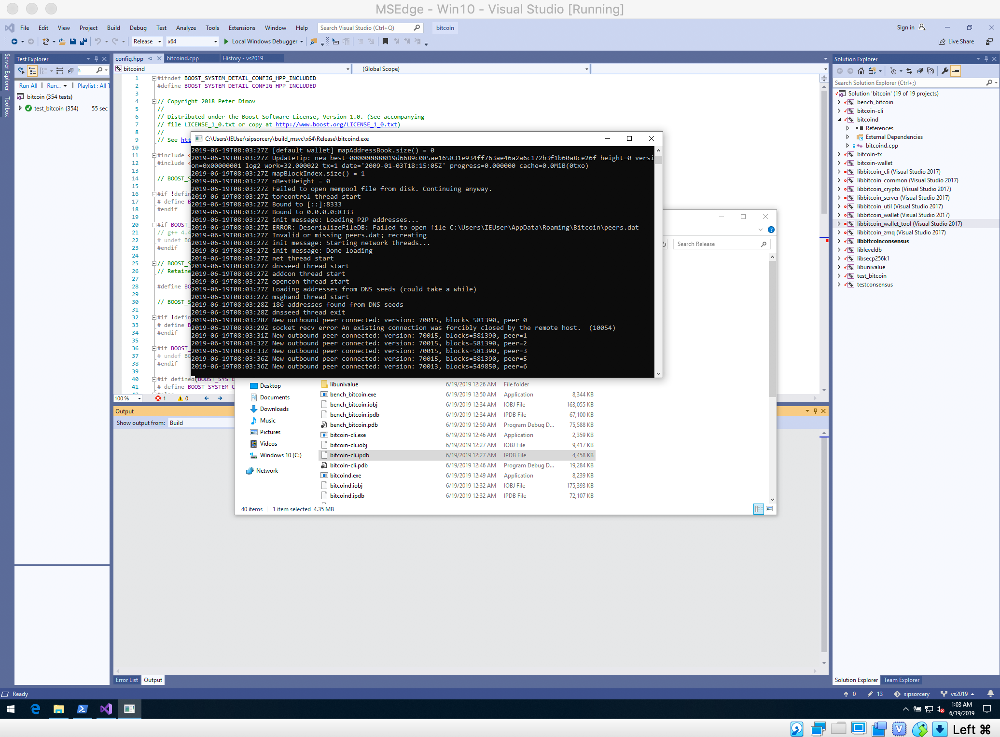

# Windows 10 Development Setup

## Download
Download the [`Virtualbox`](https://www.virtualbox.org/) version of the `MSEdge on Win10 Stable` VM from [here](https://developer.microsoft.com/en-us/microsoft-edge/tools/vms/). There are [Development Environment](https://developer.microsoft.com/en-us/windows/downloads/virtual-machines) VMs available from Microsoft, but they are ~4 times the size (~16GB), and contain lots we don't need.

## Import & Settings
Import `MSEdge - Win10.ovf` into Virtualbox, this may take some time.

Open Settings:
- System
    - Increase base memory.
    - Increase processor count.

- Display:
    - Increase video memory. 
    - Turn off Remote Display.

- Audio
    - Disable Audio.

## Boot
Login using the password `Passw0rd!`.

From the Virtulbox menu, choose `Devices`, `Insert Guest Additions..`.

Run the installer, when finished, choose to manually reboot later.

Go to `Updates & Security`, install all updates. While this is happening:

Turn on `Developer Mode`.

On the task bar, hide `Cortana`, `People` and `Task View`.

Unpin `Windows Store`, `Mail` etc.

Open `Apps & Features`. Uninstall:
- Microsoft OneDrive, News, Solitare, Mobile Plans, My Office, 
- CodeWriter
- Duolingo
- Eclispe Manager
- Feedback Hub
- Adobe *
- Network Speed Test
- OneNote
- Skype
- Sway
- Tips
- Translator
- Web Media Extensions
- Weather
- Xbox Live

When the updates finish, reboot the VM.

## Install Visual Studio

Download the `Community 2017` version of [Visual Studio](https://visualstudio.microsoft.com/vs/).

Run the Installer, when prompted choose the `Desktop development with CPP` workload. 

Choose `Git for Windows` from the Induvidual Components menu.

You can uncheck the `NuGet package manager`.

Start the installation.

When promted to connect anything, `deny`, `not now`, `never` etc.

# Install Python3

Search for `Python` in the Microsoft store.

## Install dependencies and generate project files
[Vcpkg](https://github.com/Microsoft/vcpkg.git) is used to install `c++` dependencies.
See the Bitcoin Core [MSVC build docs](https://github.com/bitcoin/bitcoin/tree/master/build_msvc) for more info.

Open `Windows PowerShell`:
```powershell
git clone https://github.com/bitcoin/bitcoin.git
git clone https://github.com/Microsoft/vcpkg.git

cd vcpkg
.\bootstrap-vcpkg.bat

# hook up user-wide integration
.\vcpkg integrate install

# Install Bitcoin Core dependencies
.\vcpkg install --triplet x64-windows-static boost-filesystem boost-signals2 boost-test libevent openssl zeromq berkeleydb secp256k1 leveldb
cd ..

# Generate Project Files
cd bitcoin\build_msvc
python msvc-autogen.py
```

## Build in Visual Studio

Open the `bitcoin\build_msvc\bitcoin.sln` file in Visual Studio.

